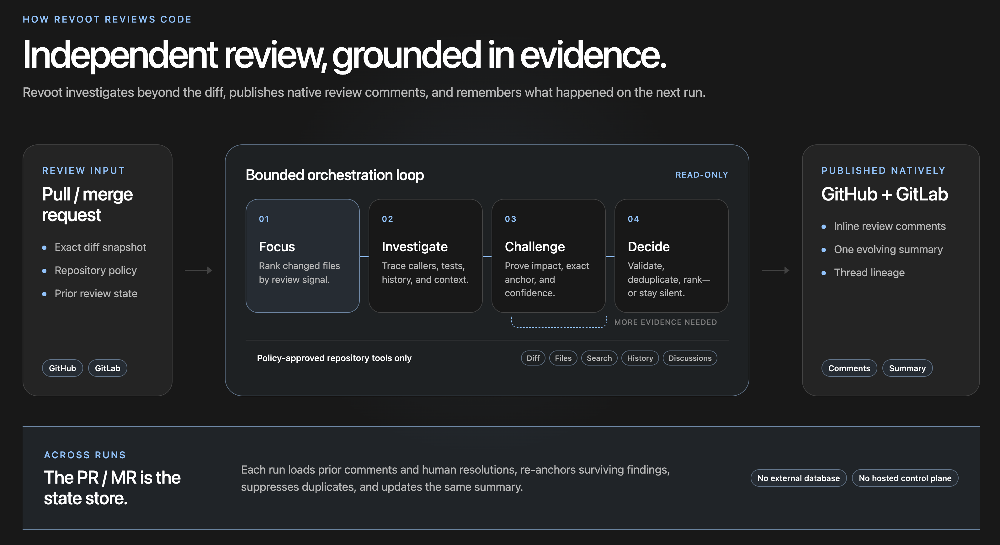

<p align="center">
  
</p>

<p align="center"><strong>Agentic code review made easy.</strong></p>

Revoot is an independent AI reviewer built for agent-written code—not a wrapper
that stuffs one giant diff into a prompt. Its review engine ranks changed files
by signal, splits large changes into bounded work units, and gives the reviewing
agent read-only tools to investigate a policy-approved checkout inventory and
commit history.
Candidate findings are evidence-checked, confidence-filtered, deduplicated, and
ranked before Revoot publishes line-specific comments and a concise risk
summary.

Reviews carry forward as the code changes. Revoot remembers existing
discussions, respects human resolutions, re-anchors findings when lines move,
and updates one summary instead of starting over or posting duplicates. The
pull or merge request is the state store—no external service or database
required.

Revoot is bring-your-own-keys (BYOK): it calls Anthropic or OpenAI directly from your
CI runner. There is no Revoot service or hosted control plane.

> Revoot is pre-1.0. Interfaces may change between minor releases.

## How Revoot Reviews Work

[](revoot.png)

## Add Revoot to Your CI

Revoot is designed to run as part of your repository's CI pipeline for pull
requests and merge requests. It runs alongside your existing checks, publishes
native line-specific findings, and maintains an evolving summary of the
implementation, risk, material concerns, and validation gaps.

### Required CI variables

- Add either `ANTHROPIC_API_KEY` or `OPENAI_API_KEY` as a secret.
- GitHub's built-in `GITHUB_TOKEN` publishes findings and the summary, preserves
  lineage state, and prevents duplicate comments. Automatic GitHub conversation
  resolution is optional and never requires a developer PAT.
- GitLab needs a masked `REVOOT_GITLAB_TOKEN` with API access to publish inline
  discussions and update the merge-request summary. Revoot treats
  `CI_JOB_TOKEN` as read-only.

Optional `REVOOT_PROVIDER` and `REVOOT_MODEL` variables override the `auto`
defaults. The [configuration reference](docs/configuration.md) lists every
supported environment and CI variable, including defaults and precedence.

For GitHub Actions:

```sh
mkdir -p .github/workflows
REVOOT_IMAGE='ghcr.io/getrevoot/revoot:VERSION@sha256:DIGEST'
docker run --rm "$REVOOT_IMAGE" init github --image "$REVOOT_IMAGE" \
  > .github/workflows/revoot.yml
```

For GitLab CI:

```sh
docker run --rm "$REVOOT_IMAGE" init gitlab --image "$REVOOT_IMAGE" \
  > .gitlab-ci.yml
```

Replace `VERSION` and `DIGEST` with the version and digest published in the
GitHub release's `image-digest.txt`; mutable tags are intentionally rejected by
the generators. Add the generated file to the repository and follow its
instructions. See the
[GitHub](docs/operations/github-actions.md) and
[GitLab](docs/operations/gitlab-component.md) guides for permissions and
self-managed hosts.

## Configuration

Configuration is optional. Add `.revoot.toml` at the repository root:

```toml
version = 1

[review]
exclude = ["vendor/**", "dist/**"]
minimum_confidence = 80
max_findings = 12

[model_context]
exclude = ["internal/**", "fixtures/private/**"]
max_inline_diff_bytes = 16384

[[rules]]
paths = ["src/payments/**"]
focus = ["authorization", "idempotency"]
```

The [configuration reference](docs/configuration.md) also covers repository
fields, guidance, budgets, and finding suppressions.

Use `revoot review --help` for command options, `--format json` for the v3
machine-readable report, or `--format sarif` for SARIF 2.1.0. Host agents can
start the read-only stdio integration with `revoot mcp serve`.

Provider-free inspection commands expose the same deterministic preparation
contracts without sending source to a model:

```sh
revoot review --preview
revoot scan --preview --format json
revoot rules check src/lib.rs --json
revoot delegate preview
revoot delegate rule src/lib.rs
```

`scan --preview` produces a body-free, immutable local scan plan. Untracked
files require the explicit local `--include-untracked` flag and are rejected in
CI. Model-backed scan execution is not enabled until the shared group-worker
engine is wired; the command fails clearly at that boundary instead of
claiming findings.

## Running Revoot locally

Run Revoot locally to catch issues before opening a pull or merge request, or
to review work in progress without publishing comments to a code host.

### Run via Docker

An immutable container image is the simplest local option. Set one provider
key, mount the repository read-only, and start a review:

```sh
export OPENAI_API_KEY=...

docker run --rm \
  --volume "$PWD:/workspace:ro" \
  --workdir /workspace \
  --env OPENAI_API_KEY \
  'ghcr.io/getrevoot/revoot:VERSION@sha256:DIGEST' review
```

For Claude, set and pass `ANTHROPIC_API_KEY` instead. Revoot reviews committed
branch changes, staged and unstaged edits, and non-ignored untracked files. It
infers the default branch; append `--base origin/release` to override it.

Revoot does not modify the checkout or execute repository code. Reviewed code
and selected repository context are sent directly to your configured provider.

### Run via native binary

Each [GitHub release](https://github.com/getrevoot/revoot/releases) includes
archives for Linux AMD64, Linux ARM64, and Apple Silicon macOS, plus a
`SHA256SUMS` file, CycloneDX SBOM, and signed build attestations. Download the
matching archive:

| System | Release asset |
| --- | --- |
| Linux x86-64 | `revoot-linux-amd64.tar.gz` |
| Linux ARM64 | `revoot-linux-arm64.tar.gz` |
| Apple Silicon macOS | `revoot-macos-arm64.tar.gz` |

Verify the archive against `SHA256SUMS`, then extract and install the binary on
your `PATH`.

## Security

Revoot is designed for zero-trust review of attacker-controlled pull-request
content. The model receives only bounded, policy-approved, read-only repository
context; it cannot execute code, access environment variables, write files,
make arbitrary network requests, or publish directly.

CI uses immutable images, least-privilege code-host permissions, restricted
egress, and safe fork defaults. See the
[security architecture and deployment checklist](docs/security.md) for the full
threat model, guarantees, and limitations.

## Development

```sh
mise install
mise run verify
```

See [CONTRIBUTING.md](CONTRIBUTING.md) for contribution guidelines and
[SECURITY.md](SECURITY.md) for private vulnerability reporting.

## License

[Apache License 2.0](LICENSE)
